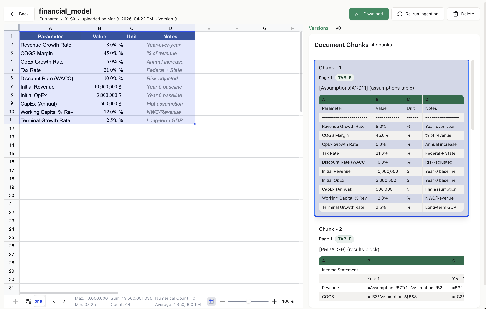
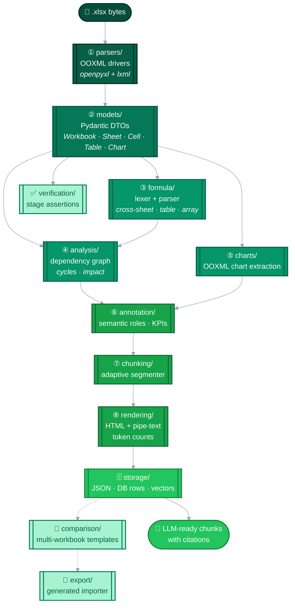

<p align="center">
  <a href="https://github.com/knowledgestack"></a>
</p>

<h1 align="center">📊 Make XLSX LLM Ready 🤖</h1>

<p align="center">
  <b><code>ks-xlsx-parser</code> is the missing ETL step between your spreadsheets and your LLM.</b>
</p>

<p align="center">
  <a href="https://pypi.org/project/ks-xlsx-parser/"></a>
  <a href="https://www.python.org/downloads/"></a>
  <a href="LICENSE"></a>
  <a href="#-the-testbench-dataset"></a>
  <a href="https://github.com/knowledgestack/ks-xlsx-parser/actions/workflows/ci.yml"></a>
</p>

<p align="center">
  <a href="https://discord.gg/4uaGhJcx"></a>
  <a href="https://github.com/knowledgestack"></a>
  <a href="https://github.com/knowledgestack/ks-xlsx-parser/discussions"></a>
  <a href="https://github.com/knowledgestack/ks-xlsx-parser/stargazers"></a>
</p>

<p align="center">
  <a href="https://www.langchain.com/"></a>
  <a href="https://langchain-ai.github.io/langgraph/"></a>
  <a href="https://www.crewai.com/"></a>
  <a href="https://github.com/openai/openai-agents-python"></a>
  <a href="https://modelcontextprotocol.io/"></a>
</p>

> [!TIP]
> **`.xlsx` → structured, typed, citation-ready JSON that an LLM can actually reason about.**
> Cells, formulas, merged regions, tables, charts, conditional formatting,
> dependency graphs, and RAG-ready chunks — deterministic, fully tested, MIT.

<p align="center">
  
  <br>
  <sub><i>Raw workbook on the left (<code>financial_model.xlsx</code>) → parser output on the right: 4 chunks, each tied back to an exact sheet!range, ready to cite in an LLM response.</i></sub>
</p>

Spreadsheets are still the #1 unstructured data source in the enterprise.
Feeding a `.xlsx` directly to an LLM loses structure (rows, formulas, merges),
loses provenance (which cell said what), and blows through context windows.
`ks-xlsx-parser` turns an Excel workbook into a token-counted, source-addressable
graph that drops straight into [LangChain](https://www.langchain.com/),
[LangGraph](https://langchain-ai.github.io/langgraph/),
[CrewAI](https://www.crewai.com/), the
[OpenAI Agents SDK](https://github.com/openai/openai-agents-python), or any
[MCP](https://modelcontextprotocol.io/)-aware client (Claude Desktop, Cursor, Windsurf, Zed, …).

<p align="center">
  <a href="https://github.com/knowledgestack/ks-xlsx-parser"></a>
  &nbsp;
  <a href="https://discord.gg/4uaGhJcx"></a>
</p>

<p align="center">
  <a href="#-30-second-demo"></a>
  &nbsp;
  <a href="docs/wiki/Quick-Start.md"></a>
  &nbsp;
  <a href="https://github.com/knowledgestack/ks-xlsx-parser/releases"></a>
</p>

---

## ✨ What you get, at a glance

<table>
  <tr>
    <td align="center" width="25%">🧾<br><b>Typed cell graph</b><br><sub>values, formulas, styles, coords</sub></td>
    <td align="center" width="25%">🧭<br><b>Citation URIs</b><br><sub><code>file.xlsx#Sheet!A1:F18</code></sub></td>
    <td align="center" width="25%">🧮<br><b>Dependency graph</b><br><sub>upstream · downstream · cycles</sub></td>
    <td align="center" width="25%">🧩<br><b>RAG-ready chunks</b><br><sub>HTML + text + token count</sub></td>
  </tr>
  <tr>
    <td align="center">📊<br><b>All 7 chart types</b><br><sub>bar · line · pie · scatter · area · radar · bubble</sub></td>
    <td align="center">🎨<br><b>Conditional formatting</b><br><sub>every Excel rule type</sub></td>
    <td align="center">📋<br><b>Tables & merges</b><br><sub>ListObjects + master/slave</sub></td>
    <td align="center">🔐<br><b>Safe by default</b><br><sub>no macros · no external links · ZIP-bomb guard</sub></td>
  </tr>
  <tr>
    <td align="center">⚡<br><b>Fast</b><br><sub>1054 workbooks / 70s in CI</sub></td>
    <td align="center">🧬<br><b>Deterministic</b><br><sub>xxhash64 content addressing</sub></td>
    <td align="center">🧰<br><b>Framework-agnostic</b><br><sub>LangChain · LangGraph · CrewAI · MCP</sub></td>
    <td align="center">📜<br><b>MIT licensed</b><br><sub>use it, fork it, ship it</sub></td>
  </tr>
</table>

---

## ⭐ If this helps you

This project is free, open source (MIT), and part of the
[**Knowledge Stack**](https://github.com/knowledgestack) ecosystem —
*document intelligence for agents*. Stars, contributions, and honest feedback
are all first-class ways to keep the lights on.

**Jump into the community:**

- 💬 **[Discord](https://discord.gg/4uaGhJcx)** — real-time help, roadmap conversations, show off what you're building. Drop in, say hi.
- 🗣 [GitHub Discussions](https://github.com/knowledgestack/ks-xlsx-parser/discussions) — async Q&A, RFCs, and long-form ideas.
- 🐞 [Issues](https://github.com/knowledgestack/ks-xlsx-parser/issues/new/choose) — report a bug, request a feature, or file a parser edge case.
- 🎯 [Show & Tell](https://github.com/knowledgestack/ks-xlsx-parser/discussions/new?category=show-and-tell) — tell us about your production use.
- 🔐 [Security](https://github.com/knowledgestack/ks-xlsx-parser/security/advisories/new) — private vulnerability disclosure.
- 🙌 [Contribute](CONTRIBUTING.md) — every PR is reviewed; `good-first-issue` labels live on Issues.
- 🧰 [Knowledge Stack org](https://github.com/knowledgestack) — see the rest of the ecosystem (ks-cookbook, ks-xlsx-parser, more on the way).

Not sure where to start? Run `make testbench`, find a file that breaks, open a
[Parser edge case](https://github.com/knowledgestack/ks-xlsx-parser/issues/new?template=parser_edge_case.yml).
That's the fastest path to a merged PR.

---

## 🚀 30-second demo

```bash
pip install ks-xlsx-parser
```

```python
from ks_xlsx_parser import parse_workbook

result = parse_workbook(path="q4_forecast.xlsx")

# LLM-ready chunks with citation URIs
for chunk in result.chunks:
    print(chunk.source_uri)          # q4_forecast.xlsx#Revenue!A1:F18
    print(chunk.token_count)         # 412
    print(chunk.render_text[:200])   # Pipe-delimited Markdown-ish text
    print(chunk.render_html[:200])   # HTML with proper colspan/rowspan

# Or dump the whole workbook graph
import json
json.dump(result.to_json(), open("workbook.json", "w"), default=str)
```

That's it. Every chunk has:
- `source_uri` — cite back to exact cells
- `render_text` / `render_html` — LLM-consumable bodies
- `token_count` — cap your context window properly
- `dependency_summary` — upstream/downstream formulas
- content hash — dedupe across versions

---

## 🗺️ Table of Contents

- [🤔 Why a dedicated XLSX parser for LLMs?](#-why-a-dedicated-xlsx-parser-for-llms)
- [🏗️ Architecture](#️-architecture)
- [📦 Installation](#-installation)
- [📚 Documentation](#-documentation)
- [⚔️ How it compares](#️-how-it-compares)
- [🎯 Who this is for](#-who-this-is-for)
- [🧪 The testBench dataset](#-the-testbench-dataset)
- [🚧 Limitations](#-limitations)
- [🧰 Knowledge Stack ecosystem](#-knowledge-stack-ecosystem)
- [📡 Stay in touch](#-stay-in-touch)
- [🙌 Contributing](#-contributing)
- [📜 License](#-license)

---

## 🤔 Why a dedicated XLSX parser for LLMs?

Most Excel libraries answer one of two questions well: *"read a rectangle of
values"* (pandas, openpyxl) or *"run Excel headless"* (xlwings, LibreOffice).
`ks-xlsx-parser` answers a third one: **"give me a structured, inspectable,
loss-minimising graph that an LLM or auditor can reason about."**

| Output | Why an LLM cares |
|--------|------------------|
| Typed cell graph (values, formulas, styles, coordinates) | Round-trips to JSON/DB/vector store without losing formulas or data types |
| Formula AST + directed dependency graph | Answer "what drives Q4 revenue?" via upstream traversal |
| Detected tables, merged regions, layout blocks | Multi-table sheets no longer collapse into one giant CSV |
| Chart extractions (bar / line / pie / scatter / area / radar / bubble) | Text summaries the model can read |
| Token-counted render chunks (HTML + pipe-text) | Plug straight into an embedding pipeline without blowing context |
| Citation-ready source URIs (`sheet!A1:B10`) | The LLM can cite the exact cell it's talking about |
| Deterministic content hashes (xxhash64) | Dedupe across versions, detect change between uploads |

Everything is deterministic, everything is tested on a 1054-workbook stress
corpus, and everything is open source.

---

## 🏗️ Architecture



The pipeline has **8 stages** (parse → analyse → annotate → segment →
render → serialise → verify → compare/export). Full breakdown in
[**Pipeline Internals**](docs/wiki/Pipeline-Internals.md).

> [!NOTE]
> The importable module is `xlsx_parser`; `ks_xlsx_parser` is a re-export
> matching the PyPI package name. The package is fully type-annotated
> (`py.typed` is shipped).

---

## 📦 Installation

Requires Python 3.10+.

```bash
pip install ks-xlsx-parser                 # core library
pip install "ks-xlsx-parser[api]"          # + FastAPI web server
pip install "ks-xlsx-parser[dev]"          # + test tooling
```

From source:

```bash
git clone https://github.com/knowledgestack/ks-xlsx-parser.git
cd ks-xlsx-parser
make install           # pip install -e ".[dev,api]"
make test              # default suite
make testbench-build   # generate the 1000-file stress corpus
make testbench         # round-trip every workbook through the parser
```

Runtime deps: `openpyxl`, `pydantic`, `lxml`, `xxhash`, `tiktoken`.

---

## 📚 Documentation

All implementation detail lives under [`docs/wiki/`](docs/wiki/) (mirrored
to the [GitHub Wiki](https://github.com/knowledgestack/ks-xlsx-parser/wiki)
on each release) so this README stays scannable:

- 🚀 [**Quick Start**](docs/wiki/Quick-Start.md) — parse, iterate chunks, walk the dep graph, serialise, parse from bytes. Five short snippets, ~90 % of real usage.
- 📖 [**API Reference**](docs/wiki/API-Reference.md) — full signatures for `parse_workbook`, `compare_workbooks`, `export_importer`, `StageVerifier`.
- 🌐 [**Web API**](docs/wiki/Web-API.md) — the bundled FastAPI server, Python + TypeScript clients, deployment notes.
- 📦 [**Data Models**](docs/wiki/Data-Models.md) — every Pydantic DTO field by field.
- 🛠 [**Pipeline Internals**](docs/wiki/Pipeline-Internals.md) — where to hook in if you want to extend the parser.
- 📜 [**Workbook Graph Spec**](docs/WORKBOOK_GRAPH_SPEC.md) — canonical schema for the output.
- 🐛 [**Known Issues**](docs/PARSER_KNOWN_ISSUES.md) — documented edge cases.
- 📝 [**CHANGELOG**](CHANGELOG.md) — release history.

---

## ⚔️ How it compares

| | pandas / openpyxl | Docling | `ks-xlsx-parser` |
|---|:---:|:---:|:---:|
| Reads values | ✅ | ✅ | ✅ |
| Keeps **formulas** | ⚠️ raw string | ❌ | ✅ parsed + dependency graph |
| Preserves **merges** | ⚠️ coords only | ⚠️ partial | ✅ master/slave with colspan/rowspan |
| Extracts **charts** | ❌ | ❌ | ✅ all 7 chart types + text summary |
| **Conditional formatting** | ❌ | ❌ | ✅ cell/color-scale/icon/data-bar/formula |
| **Data validation** (dropdowns) | ❌ | ❌ | ✅ all types incl. cross-sheet lists |
| **Multi-table** sheet layout | ❌ | ⚠️ | ✅ adaptive-gap segmentation |
| Per-chunk **source URI** (citation) | ❌ | ⚠️ | ✅ `file.xlsx#Sheet!A1:F18` |
| **Token counts** per chunk | ❌ | ❌ | ✅ via `tiktoken` |
| **Dependency graph** traversal | ❌ | ❌ | ✅ upstream / downstream, cycle detection |
| Deterministic **content hashes** | ❌ | ❌ | ✅ xxhash64 per cell / block / chunk |
| Streaming `.xlsx` > 100 MB | ⚠️ | ❌ | ✅ (chunked parse) |

Most tools give you a dataframe. `ks-xlsx-parser` gives you a **graph an LLM can cite**.

---

## 🎯 Who this is for

Teams shipping agents, RAG pipelines, or auditing tools that ingest Excel.

<table>
  <tr>
    <td align="center" width="20%">🏦<br><b>Banking &amp; Finance</b><br><sub>KPI extraction, formula lineage, regulator-ready citations</sub></td>
    <td align="center" width="20%">⚖️<br><b>Legal &amp; Contracts</b><br><sub>schedules, fee tables, covenant matrices without flattening merges</sub></td>
    <td align="center" width="20%">🏥<br><b>Healthcare &amp; Insurance</b><br><sub>normalise claims, pricing, and actuarial sheets into auditable JSON</sub></td>
    <td align="center" width="20%">🏗️<br><b>Real Estate &amp; Construction</b><br><sub>quantity takeoffs and cost models that still live in XLSX</sub></td>
    <td align="center" width="20%">📈<br><b>Sales Ops / HR / Engineering</b><br><sub>"source of truth is a spreadsheet" → structured events, in minutes</sub></td>
  </tr>
</table>

> [!IMPORTANT]
> **Not a fit** if you need to *execute* Excel (recalculate, run VBA, pivot-refresh).
> Use xlwings or a headless Excel for that. `ks-xlsx-parser` reads; it doesn't run.

---

## 🧪 The testBench dataset

A **1054-workbook stress corpus** ships under [`testBench/`](testBench/) and
is round-tripped in CI on every commit. It's the easiest way to see whether
the parser does the right thing on *your* kind of workbook.

| Group | Files | What it covers |
|-------|------:|----------------|
| `real_world/`            | 8    | Real anonymised workbooks (financial, engineering, project tracking) |
| `enterprise/`            | 4    | Deterministic enterprise templates |
| `github_datasets/`       | 10   | Public datasets (iris, titanic, superstore, …) |
| `stress/curated/`        | 26   | 26 progressive stress levels authored by hand |
| `stress/merges/`         | 5    | Pathological merge patterns |
| `generated/matrix/`      | 297  | One feature per file across 18 categories |
| `generated/combo/`       | 400  | Deterministic feature cocktails (5 densities × 80 seeds) |
| `generated/adversarial/` | 300  | Unicode bombs, circular refs, 32k-char cells, deep formula chains, sparse 1M-row sheets, 250-sheet workbooks |

```bash
make testbench-build   # regenerate testBench/generated/ (~1 minute)
make testbench         # 1054/1054 in ~70 seconds
make testbench-zip     # package as dist/testBench-vX.Y.Z.zip for a GitHub release
```

The zipped dataset is attached to every [release](https://github.com/knowledgestack/ks-xlsx-parser/releases)
— pull it if you don't want to clone the full repo.

---

## 🚧 Limitations

- **`.xls` not supported** — only `.xlsx` and `.xlsm` (OOXML). Convert legacy files externally.
- **Pivot tables** — detected but not fully parsed.
- **Sparklines** — not extracted.
- **VBA macros** — flagged but never executed or analysed.
- **External links** — recorded but not resolved.
- **Threaded comments** — only legacy comments are supported (openpyxl limitation).
- **Embedded OLE objects** — detected but not extracted.
- **Locale-dependent number formats** — not interpreted.

Full list in [`docs/PARSER_KNOWN_ISSUES.md`](docs/PARSER_KNOWN_ISSUES.md).

---

## 🧰 Knowledge Stack ecosystem

`ks-xlsx-parser` is one piece of the [**Knowledge Stack**](https://github.com/knowledgestack)
open-source family — *document intelligence for agents*, built so that
engineering teams can focus on agents and we handle the messy parts of
enterprise data.

| Repo | What it does |
|------|--------------|
| [**ks-cookbook**](https://github.com/knowledgestack/ks-cookbook) | 32 production-style flagship agents + recipes for LangChain, LangGraph, CrewAI, Temporal, the OpenAI Agents SDK, and any [MCP](https://modelcontextprotocol.io/) client. |
| [**ks-xlsx-parser**](https://github.com/knowledgestack/ks-xlsx-parser) (this repo) | Turn `.xlsx` into LLM-ready JSON with citations and dependency graphs. |
| [@knowledgestack](https://github.com/knowledgestack) | Follow the org for upcoming repos — parsers, extractors, and MCP servers for PDF, DOCX, PPTX, HTML, and more. |

Building on top of the stack? Tell us about it in
[Show & Tell](https://github.com/knowledgestack/ks-xlsx-parser/discussions/new?category=show-and-tell)
or the [#showcase](https://discord.gg/4uaGhJcx) channel on Discord.

---

## 📡 Stay in touch

<p align="center">
  <a href="https://discord.gg/4uaGhJcx"></a>
  <a href="https://github.com/knowledgestack"></a>
  <a href="https://github.com/knowledgestack/ks-xlsx-parser/discussions"></a>
</p>

- 💬 **[Join the Discord](https://discord.gg/4uaGhJcx)** — our main real-time channel. Roadmap, help, job postings, show-and-tell, and the occasional meme.
- 🐙 **[Follow @knowledgestack](https://github.com/knowledgestack)** on GitHub for new releases across the ecosystem.
- 📣 Watch this repo (→ *Releases only*) to get pinged when `ks-xlsx-parser` ships an update.

If you'd rather just peek first — thousands of parsed workbooks live in the
[testBench release](https://github.com/knowledgestack/ks-xlsx-parser/releases)
as a single zip. Pull it, diff it, file an issue if your Excel does something
weirder than ours.

---

## 🙌 Contributing

We love contributions. Three paths, in order of speed-to-merge:

1. **Report a testBench failure** — run `make testbench`, find a file that
   breaks, attach it to a
   [Parser edge case issue](https://github.com/knowledgestack/ks-xlsx-parser/issues/new?template=parser_edge_case.yml).
2. **Add a new adversarial workbook** — contribute a builder to
   `scripts/build_testbench.py`. Any file that makes the parser crash or
   lose information is welcome.
3. **Fix a flagged issue** — see [`docs/PARSER_KNOWN_ISSUES.md`](docs/PARSER_KNOWN_ISSUES.md).

Full dev loop, PR checklist, and code style in [`CONTRIBUTING.md`](CONTRIBUTING.md).
See the [Code of Conduct](CODE_OF_CONDUCT.md) and
[Security policy](SECURITY.md) before posting.

If you don't have time to contribute but the project helped you, please
**[star the repo](https://github.com/knowledgestack/ks-xlsx-parser)**. That's
the main signal that keeps this maintained.

---

## 📜 License

[MIT](LICENSE). Use it, fork it, ship it. Attribution appreciated but not required.

If you ship something built on top of `ks-xlsx-parser`, we'd love a
[Show & Tell](https://github.com/knowledgestack/ks-xlsx-parser/discussions/new?category=show-and-tell)
post or a shoutout on [Discord](https://discord.gg/4uaGhJcx).
