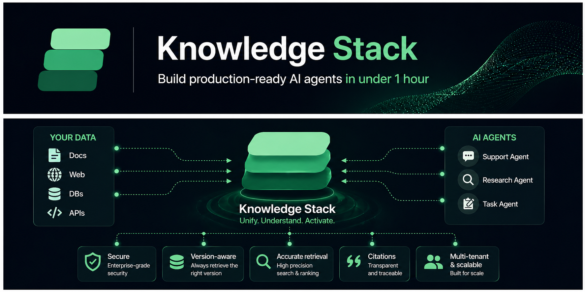
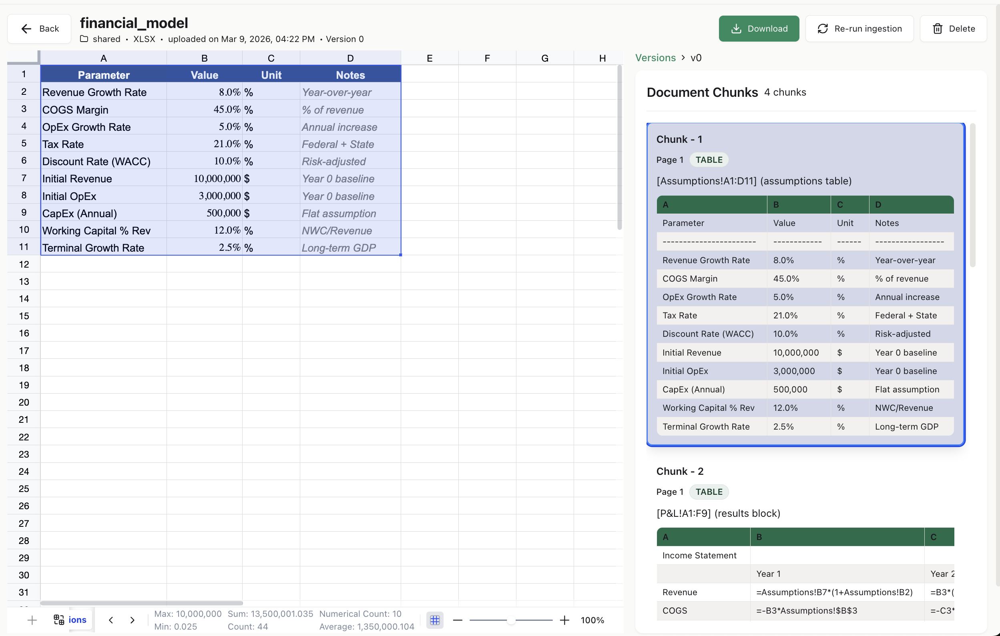

<p align="center">
  <a href="https://github.com/knowledgestack/excel-parser"></a>
  <a href="https://github.com/knowledgestack/excel-parser/fork"></a>
  <a href="https://github.com/knowledgestack/excel-parser/stargazers"></a>
</p>

<p align="center">
  <a href="https://github.com/knowledgestack"></a>
</p>

<h1 align="center">📊 Make XLSX LLM Ready 🤖</h1>

<p align="center">
  <b><code>excel-parser</code> — the open-source Python library that parses Excel (.xlsx) files into citation-ready JSON for LLMs, RAG pipelines, and AI agents (LangChain, LangGraph, CrewAI, OpenAI Agents SDK, Claude, MCP).</b>
</p>

<p align="center">
  <a href="https://pypi.org/project/excel-parser/"></a>
  <a href="https://www.python.org/downloads/"></a>
  <a href="LICENSE"></a>
  <a href="tests/benchmarks/reports/COMPARISON.md"></a>
  <a href="https://github.com/knowledgestack/excel-parser/actions/workflows/ci.yml"></a>
</p>

<p align="center">
  <a href="https://discord.gg/4uaGhJcx"></a>
  <a href="https://github.com/knowledgestack"></a>
  <a href="https://github.com/knowledgestack/excel-parser/discussions"></a>
  <a href="https://github.com/knowledgestack/excel-parser/stargazers"></a>
  <a href="https://knowledgestack.github.io/excel-parser/"></a>
</p>

<p align="center">
  <a href="https://www.langchain.com/"></a>
  <a href="https://langchain-ai.github.io/langgraph/"></a>
  <a href="https://www.crewai.com/"></a>
  <a href="https://github.com/openai/openai-agents-python"></a>
  <a href="https://modelcontextprotocol.io/"></a>
</p>

> [!TIP]
> **`.xlsx` → structured, typed, citation-ready JSON that an LLM can actually reason about.**
> Cells, formulas, merged regions, tables, charts, conditional formatting,
> dependency graphs, and RAG-ready chunks — deterministic, fully tested, MIT.

<p align="center">
  
  <br>
  <sub><i>Raw workbook on the left (<code>financial_model.xlsx</code>) → parser output on the right: 4 chunks, each tied back to an exact sheet!range, ready to cite in an LLM response.</i></sub>
</p>

Spreadsheets are still the #1 unstructured data source in the enterprise.
Feeding a `.xlsx` directly to an LLM loses structure (rows, formulas, merges),
loses provenance (which cell said what), and blows through context windows.
`excel-parser` turns an Excel workbook into a token-counted, source-addressable
graph that drops straight into [LangChain](https://www.langchain.com/),
[LangGraph](https://langchain-ai.github.io/langgraph/),
[CrewAI](https://www.crewai.com/), the
[OpenAI Agents SDK](https://github.com/openai/openai-agents-python), or any
[MCP](https://modelcontextprotocol.io/)-aware client (Claude Desktop, Cursor, Windsurf, Zed, …).

<p align="center">
  <a href="https://github.com/knowledgestack/excel-parser"></a>
  &nbsp;
  <a href="https://discord.gg/4uaGhJcx"></a>
</p>

<p align="center">
  <a href="#-30-second-demo"></a>
  &nbsp;
  <a href="docs/wiki/Quick-Start.md"></a>
  &nbsp;
  <a href="tests/benchmarks/reports/COMPARISON.md"></a>
</p>

---

## 🏁 Benchmark — excel-parser vs Docling on SpreadsheetBench

<p align="center">
  <a href="tests/benchmarks/reports/COMPARISON.md"></a>
  <a href="tests/benchmarks/reports/COMPARISON.md"></a>
  <a href="tests/benchmarks/reports/COMPARISON.md"></a>
  <a href="tests/benchmarks/reports/COMPARISON.md"></a>
</p>

Apples-to-apples on [SpreadsheetBench v0.1](https://github.com/RUCKBReasoning/SpreadsheetBench): 912 real-world task instances curated from ExcelHome / Mr.Excel / r/excel. Both parsers are scored in the **same run on the same harness** — for each instance we parse the input `.xlsx`, embed every chunk with `BAAI/bge-small-en-v1.5`, then check whether the chunk containing the ground-truth answer is in the top-k by similarity to the question. Text-match recall is reported over the **scoreable** instances (the harness excludes instances whose answer cell is empty/uncached for *both* parsers equally).

<table>
<thead>
<tr>
  <th align="left">Metric</th>
  <th align="center" bgcolor="#047857"><span style="color:#FFFFFF"><b>🟢 excel-parser</b></span></th>
  <th align="center" bgcolor="#475569"><span style="color:#FFFFFF"><b>⚪ Docling 2.93</b></span></th>
  <th align="center">Δ</th>
</tr>
</thead>
<tbody>
<tr>
  <td><b>📊 Parse success</b><br/><sub>5,458-file corpus</sub></td>
  <td align="center" bgcolor="#D1FAE5"><br/><sub>5,461 ok · 3 timeouts · 0 errors</sub></td>
  <td align="center" bgcolor="#F1F5F9"><sub>not run at scale</sub></td>
  <td align="center">—</td>
</tr>
<tr>
  <td><b>🎯 Recall@1</b><br/><sub>text-match</sub></td>
  <td align="center" bgcolor="#F1F5F9"></td>
  <td align="center" bgcolor="#E0E7FF"></td>
  <td align="center"></td>
</tr>
<tr>
  <td><b>🎯 Recall@3</b><br/><sub>text-match</sub></td>
  <td align="center" bgcolor="#A7F3D0"></td>
  <td align="center" bgcolor="#F1F5F9"></td>
  <td align="center"></td>
</tr>
<tr>
  <td><b>🎯 Recall@5</b><br/><sub>text-match</sub></td>
  <td align="center" bgcolor="#A7F3D0"></td>
  <td align="center" bgcolor="#F1F5F9"></td>
  <td align="center"></td>
</tr>
<tr>
  <td><b>📍 Geometric Recall@5</b><br/><sub>chunk's <code>sheet!A1:Z99</code> overlaps the ground-truth range</sub></td>
  <td align="center" bgcolor="#6EE7B7"></td>
  <td align="center" bgcolor="#FEE2E2"></td>
  <td align="center"></td>
</tr>
<tr>
  <td><b>⚡ Parse time</b><br/><sub>per file</sub></td>
  <td align="center" bgcolor="#FFFFFF"><br/><sub>11 ms median</sub></td>
  <td align="center" bgcolor="#E0E7FF"><br/><sub>13 ms median</sub></td>
  <td align="center"></td>
</tr>
<tr>
  <td><b>🧱 Parser errors</b><br/><sub>across 912 instances</sub></td>
  <td align="center" bgcolor="#D1FAE5"></td>
  <td align="center" bgcolor="#F1F5F9"></td>
  <td align="center">—</td>
</tr>
</tbody>
</table>

### 💡 What the numbers mean

- **Text-match recall is a close race — call it honestly.** Docling edges `excel-parser` at recall@1 (0.708 vs 0.693, **+1.5 pp Docling**); `excel-parser` takes recall@3 (**+2.8 pp**) and recall@5 (**+1.9 pp**). Text-match is parser-agnostic — it asks whether *any* parser surfaced a chunk containing the answer string, after normalising commas, percent signs, ISO dates, and booleans on both sides. For retrieval *quality* alone, the two are roughly even.
- **The real separation is citation-grade (geometric) recall: `0.889` vs `0.000`.** `excel-parser` emits a `sheet!A1:Z99` range on every chunk, so a top-k hit can cite the exact source cells; Docling produces markdown with **no cell coordinates**, so it structurally cannot — this is a *capability gap*, not an extraction-quality failure. It's the difference between "the answer is somewhere in the workbook" and "the answer is in `Revenue!C7`." (In-scope geometric recall@5 is **0.960** — see [`COMPARISON.md`](tests/benchmarks/reports/COMPARISON.md).)
- **Parse time is mixed, and `excel-parser` is not uniformly faster.** Median per-file latency is comparable (~11–13 ms, `excel-parser` slightly ahead); on the **mean**, Docling is faster (238 ms vs 349 ms) because `excel-parser`'s large-table row-windowing renders big sheets more than once. Both parse 0 of 912 with errors.
- **Harness honesty.** The geometric and text numbers above use a corrected harness vs. earlier releases: (1) geometric overlap now credits a match when the dataset omits the sheet name (~62% of instances are single-sheet) instead of comparing a real sheet name against `""` — this raised `excel-parser`'s geometric recall from the previously-reported 0.369 (the parser always pointed correctly; the old metric under-counted), and leaves Docling at 0.000; (2) instances whose answer cell is empty/uncached are excluded from the **text** denominator for *both* parsers. Both fixes are parser-independent and covered by unit tests.
- **`Marker` is excluded by design.** Its xlsx → HTML → PDF → layout-recognition pipeline clocks >30 min per workbook on CPU. The benchmark framework supports adding a Marker adapter when GPU is available — see [`tests/benchmarks/adapters/docling_adapter.py`](tests/benchmarks/adapters/docling_adapter.py) as a template.

### 🔁 Reproduce

```bash
make corpus-download   # one-time, ~100 MB; gitignored under data/corpora/
make bench             # robustness + retrieval, ~50 min on M-series CPU
open tests/benchmarks/reports/COMPARISON.md
```

Full methodology, capability matrix, error breakdown, and caveats live in [`tests/benchmarks/reports/COMPARISON.md`](tests/benchmarks/reports/COMPARISON.md). Adapter design notes in [`tests/benchmarks/README.md`](tests/benchmarks/README.md).

---

## ✨ What you get, at a glance

<table>
  <tr>
    <td align="center" width="25%">🧾<br><b>Typed cell graph</b><br><sub>values, formulas, styles, coords</sub></td>
    <td align="center" width="25%">🧭<br><b>Citation URIs</b><br><sub><code>file.xlsx#Sheet!A1:F18</code></sub></td>
    <td align="center" width="25%">🧮<br><b>Dependency graph</b><br><sub>upstream · downstream · cycles</sub></td>
    <td align="center" width="25%">🧩<br><b>RAG-ready chunks</b><br><sub>HTML + text + token count</sub></td>
  </tr>
  <tr>
    <td align="center">📊<br><b>All 7 chart types</b><br><sub>bar · line · pie · scatter · area · radar · bubble</sub></td>
    <td align="center">🎨<br><b>Conditional formatting</b><br><sub>every Excel rule type</sub></td>
    <td align="center">📋<br><b>Tables & merges</b><br><sub>ListObjects + master/slave</sub></td>
    <td align="center">🔐<br><b>Safe by default</b><br><sub>no macros · no external links · ZIP-bomb guard</sub></td>
  </tr>
  <tr>
    <td align="center">⚡<br><b>Fast</b><br><sub>1054 workbooks / 70s in CI</sub></td>
    <td align="center">🧬<br><b>Deterministic</b><br><sub>xxhash64 content addressing</sub></td>
    <td align="center">🧰<br><b>Framework-agnostic</b><br><sub>LangChain · LangGraph · CrewAI · MCP</sub></td>
    <td align="center">📜<br><b>MIT licensed</b><br><sub>use it, fork it, ship it</sub></td>
  </tr>
</table>

---

## ⭐ If this helps you

This project is free, open source (MIT), and part of the
[**Knowledge Stack**](https://github.com/knowledgestack) ecosystem —
*document intelligence for agents*. Stars, contributions, and honest feedback
are all first-class ways to keep the lights on.

**Jump into the community:**

- 💬 **[Discord](https://discord.gg/4uaGhJcx)** — real-time help, roadmap conversations, show off what you're building. Drop in, say hi.
- 🗣 [GitHub Discussions](https://github.com/knowledgestack/excel-parser/discussions) — async Q&A, RFCs, and long-form ideas.
- 🐞 [Issues](https://github.com/knowledgestack/excel-parser/issues/new/choose) — report a bug, request a feature, or file a parser edge case.
- 🎯 [Show & Tell](https://github.com/knowledgestack/excel-parser/discussions/new?category=show-and-tell) — tell us about your production use.
- 🔐 [Security](https://github.com/knowledgestack/excel-parser/security/advisories/new) — private vulnerability disclosure.
- 🙌 [Contribute](CONTRIBUTING.md) — every PR is reviewed; `good-first-issue` labels live on Issues.
- 🧰 [Knowledge Stack org](https://github.com/knowledgestack) — see the rest of the ecosystem (ks-cookbook, excel-parser, more on the way).

Not sure where to start? Run `make bench-robust` on SpreadsheetBench, find a
file that breaks, open a
[Parser edge case](https://github.com/knowledgestack/excel-parser/issues/new?template=parser_edge_case.yml).
That's the fastest path to a merged PR.

---

## 🚀 30-second demo

```bash
pip install excel-parser
```

```python
from excel_parser import parse_workbook

result = parse_workbook(path="q4_forecast.xlsx")

# LLM-ready chunks with citation URIs
for chunk in result.chunks:
    print(chunk.source_uri)          # q4_forecast.xlsx#Revenue!A1:F18
    print(chunk.token_count)         # 412
    print(chunk.render_text[:200])   # Pipe-delimited Markdown-ish text
    print(chunk.render_html[:200])   # HTML with proper colspan/rowspan

# Or dump the whole workbook graph
import json
json.dump(result.to_json(), open("workbook.json", "w"), default=str)
```

That's it. Every chunk has:
- `source_uri` — cite back to exact cells
- `render_text` / `render_html` — LLM-consumable bodies
- `token_count` — cap your context window properly
- `dependency_summary` — upstream/downstream formulas
- content hash — dedupe across versions

---

## 🗺️ Table of Contents

- [🏁 Benchmark — vs Docling on SpreadsheetBench](#-benchmark--excel-parser-vs-docling-on-spreadsheetbench)
- [🤔 Why a dedicated XLSX parser for LLMs?](#-why-a-dedicated-excel-parser-for-llms)
- [🏗️ Architecture](#️-architecture)
- [📦 Installation](#-installation)
- [📚 Documentation](#-documentation)
- [⚔️ How it compares](#️-how-it-compares)
- [🎯 Who this is for](#-who-this-is-for)
- [📊 Benchmarks](#-benchmarks)
- [🚧 Limitations](#-limitations)
- [🧰 Knowledge Stack ecosystem](#-knowledge-stack-ecosystem)
- [📡 Stay in touch](#-stay-in-touch)
- [🙌 Contributing](#-contributing)
- [❓ FAQ](#-faq)
- [📜 License](#-license)

---

## 🤔 Why a dedicated XLSX parser for LLMs?

Most Excel libraries answer one of two questions well: *"read a rectangle of
values"* (pandas, openpyxl) or *"run Excel headless"* (xlwings, LibreOffice).
`excel-parser` answers a third one: **"give me a structured, inspectable,
loss-minimising graph that an LLM or auditor can reason about."**

| Output | Why an LLM cares |
|--------|------------------|
| Typed cell graph (values, formulas, styles, coordinates) | Round-trips to JSON/DB/vector store without losing formulas or data types |
| Formula AST + directed dependency graph | Answer "what drives Q4 revenue?" via upstream traversal |
| Detected tables, merged regions, layout blocks | Multi-table sheets no longer collapse into one giant CSV |
| Chart extractions (bar / line / pie / scatter / area / radar / bubble) | Text summaries the model can read |
| Token-counted render chunks (HTML + pipe-text) | Plug straight into an embedding pipeline without blowing context |
| Citation-ready source URIs (`sheet!A1:B10`) | The LLM can cite the exact cell it's talking about |
| Deterministic content hashes (xxhash64) | Dedupe across versions, detect change between uploads |

Everything is deterministic, everything is tested on a 1054-workbook stress
corpus, and everything is open source.

---

## 🏗️ Architecture

The pipeline runs **8 deterministic stages**: parse → analyse → annotate → segment → render → serialise → verify → compare/export. Full diagram, stage-by-stage breakdown, and module map in [**docs/wiki/Architecture.md**](docs/wiki/Architecture.md). Stage internals in [**Pipeline Internals**](docs/wiki/Pipeline-Internals.md).

> [!NOTE]
> The importable module is `excel_parser`; `excel_parser` is a re-export
> matching the PyPI package name. The package is fully type-annotated
> (`py.typed` is shipped).

---

## 📦 Installation

Requires Python 3.10+.

```bash
pip install excel-parser                 # core library
pip install "excel-parser[api]"          # + FastAPI web server
pip install "excel-parser[dev]"          # + test tooling
```

From source:

```bash
git clone https://github.com/knowledgestack/excel-parser.git
cd excel-parser
make install           # pip install -e ".[dev,api]"
make test              # default suite
make corpus-download   # fetch SpreadsheetBench (5,458 real-world xlsx)
make bench-robust      # parse-success + structural counts vs Docling
make bench-retrieval   # retrieval recall@k vs Docling
```

Runtime deps: `openpyxl`, `pydantic`, `lxml`, `xxhash`, `tiktoken`.

---

## 📚 Documentation

All implementation detail lives under [`docs/wiki/`](docs/wiki/) (mirrored
to the [GitHub Wiki](https://github.com/knowledgestack/excel-parser/wiki)
on each release) so this README stays scannable:

- 🚀 [**Quick Start**](docs/wiki/Quick-Start.md) — parse, iterate chunks, walk the dep graph, serialise, parse from bytes. Five short snippets, ~90 % of real usage.
- 📖 [**API Reference**](docs/wiki/API-Reference.md) — full signatures for `parse_workbook`, `compare_workbooks`, `export_importer`, `StageVerifier`.
- 🌐 [**Web API**](docs/wiki/Web-API.md) — the bundled FastAPI server, Python + TypeScript clients, deployment notes.
- 📦 [**Data Models**](docs/wiki/Data-Models.md) — every Pydantic DTO field by field.
- 🛠 [**Pipeline Internals**](docs/wiki/Pipeline-Internals.md) — where to hook in if you want to extend the parser.
- 📜 [**Workbook Graph Spec**](docs/WORKBOOK_GRAPH_SPEC.md) — canonical schema for the output.
- 🐛 [**Known Issues**](docs/PARSER_KNOWN_ISSUES.md) — documented edge cases.
- 📝 [**CHANGELOG**](CHANGELOG.md) — release history.

---

## ⚔️ How it compares

This is the **structural** capability matrix. For head-to-head retrieval numbers (recall@k, geometric, latency) on a 912-instance real-world corpus, see [🏁 Benchmark — excel-parser vs Docling on SpreadsheetBench](#-benchmark--excel-parser-vs-docling-on-spreadsheetbench) up top.

| | pandas / openpyxl | Docling | `excel-parser` |
|---|:---:|:---:|:---:|
| Reads values | ✅ | ✅ | ✅ |
| Keeps **formulas** | ⚠️ raw string | ❌ | ✅ parsed + dependency graph |
| Preserves **merges** | ⚠️ coords only | ⚠️ partial | ✅ master/slave with colspan/rowspan |
| Extracts **charts** | ❌ | ❌ | ✅ all 7 chart types + text summary |
| **Conditional formatting** | ❌ | ❌ | ✅ cell/color-scale/icon/data-bar/formula |
| **Data validation** (dropdowns) | ❌ | ❌ | ✅ all types incl. cross-sheet lists |
| **Multi-table** sheet layout | ❌ | ⚠️ | ✅ adaptive-gap segmentation |
| Per-chunk **source URI** (citation) | ❌ | ⚠️ | ✅ `file.xlsx#Sheet!A1:F18` |
| **Token counts** per chunk | ❌ | ❌ | ✅ via `tiktoken` |
| **Dependency graph** traversal | ❌ | ❌ | ✅ upstream / downstream, cycle detection |
| Deterministic **content hashes** | ❌ | ❌ | ✅ xxhash64 per cell / block / chunk |
| Streaming `.xlsx` > 100 MB | ⚠️ | ❌ | ✅ (chunked parse) |

Most tools give you a dataframe. `excel-parser` gives you a **graph an LLM can cite**.

---

> Looking for a tiny, edge-runtime I/O library with write support? See
> [**`hucre`**](https://github.com/productdevbook/hucre) by
> [**@productdevbook**](https://github.com/productdevbook). For an unbiased
> head-to-head on the SpreadsheetBench corpus — perf numbers,
> extraction-count parity, where each side wins — see the wiki:
> [**`excel-parser` vs `hucre`**](docs/wiki/Benchmark-vs-hucre.md).

---

## 🎯 Who this is for

Teams shipping agents, RAG pipelines, or auditing tools that ingest Excel.

<table>
  <tr>
    <td align="center" width="20%">🏦<br><b>Banking &amp; Finance</b><br><sub>KPI extraction, formula lineage, regulator-ready citations</sub></td>
    <td align="center" width="20%">⚖️<br><b>Legal &amp; Contracts</b><br><sub>schedules, fee tables, covenant matrices without flattening merges</sub></td>
    <td align="center" width="20%">🏥<br><b>Healthcare &amp; Insurance</b><br><sub>normalise claims, pricing, and actuarial sheets into auditable JSON</sub></td>
    <td align="center" width="20%">🏗️<br><b>Real Estate &amp; Construction</b><br><sub>quantity takeoffs and cost models that still live in XLSX</sub></td>
    <td align="center" width="20%">📈<br><b>Sales Ops / HR / Engineering</b><br><sub>"source of truth is a spreadsheet" → structured events, in minutes</sub></td>
  </tr>
</table>

> [!IMPORTANT]
> **Not a fit** if you need to *execute* Excel (recalculate, run VBA, pivot-refresh).
> Use xlwings or a headless Excel for that. `excel-parser` reads; it doesn't run.

---

## 📊 Benchmarks

We benchmark against **SpreadsheetBench v0.1** — 912 instruction × xlsx tasks
(5,458 unique workbooks) covering financial models, project trackers,
HR records, scientific data, and a long tail of small business spreadsheets.

| Benchmark | What it measures | Cost |
|---|---|---|
| `make bench-robust` | Parse-success rate + structural counts vs Docling | ~20 min |
| `make bench-retrieval` | Top-k retrieval recall + table fragmentation rate vs Docling | ~40 min |

Headline numbers and methodology live in
[`tests/benchmarks/reports/COMPARISON.md`](tests/benchmarks/reports/COMPARISON.md).
The corpus is downloaded on demand (`make corpus-download`) and gitignored —
nothing is committed to the repo.

---

## 🚧 Limitations

- **Legacy `.xls` (BIFF)** — supported via in-memory conversion to `.xlsx`. If **LibreOffice** is installed (auto-detected, headless), conversion is **full-fidelity**: formula text, cached values, charts, shapes, and styling are all preserved. Without LibreOffice, a pure-Python `xlrd` fallback preserves values, types, number formats, merges, and basic styling, but **not** formula text or charts (cached formula values still survive). Disable the LibreOffice path with `EXCEL_PARSER_DISABLE_SOFFICE=1`.
- **Pivot tables** — detected but not fully parsed.
- **Sparklines** — not extracted.
- **VBA macros** — flagged but never executed or analysed.
- **External links** — recorded but not resolved.
- **Threaded comments** — only legacy comments are supported (openpyxl limitation).
- **Embedded OLE objects** — detected but not extracted.
- **Locale-dependent number formats** — not interpreted.

Full list in [`docs/PARSER_KNOWN_ISSUES.md`](docs/PARSER_KNOWN_ISSUES.md).

---

## 🧰 Knowledge Stack ecosystem

`excel-parser` is one piece of the [**Knowledge Stack**](https://github.com/knowledgestack)
open-source family — *document intelligence for agents*, built so that
engineering teams can focus on agents and we handle the messy parts of
enterprise data.

| Repo | What it does |
|------|--------------|
| [**ks-cookbook**](https://github.com/knowledgestack/ks-cookbook) | 32 production-style flagship agents + recipes for LangChain, LangGraph, CrewAI, Temporal, the OpenAI Agents SDK, and any [MCP](https://modelcontextprotocol.io/) client. |
| [**excel-parser**](https://github.com/knowledgestack/excel-parser) (this repo) | Turn `.xlsx` into LLM-ready JSON with citations and dependency graphs. |
| [@knowledgestack](https://github.com/knowledgestack) | Follow the org for upcoming repos — parsers, extractors, and MCP servers for PDF, DOCX, PPTX, HTML, and more. |

Building on top of the stack? Tell us about it in
[Show & Tell](https://github.com/knowledgestack/excel-parser/discussions/new?category=show-and-tell)
or the [#showcase](https://discord.gg/4uaGhJcx) channel on Discord.

---

## 📡 Stay in touch

<p align="center">
  <a href="https://discord.gg/4uaGhJcx"></a>
  <a href="https://github.com/knowledgestack"></a>
  <a href="https://github.com/knowledgestack/excel-parser/discussions"></a>
</p>

- 💬 **[Join the Discord](https://discord.gg/4uaGhJcx)** — our main real-time channel. Roadmap, help, job postings, show-and-tell, and the occasional meme.
- 🐙 **[Follow @knowledgestack](https://github.com/knowledgestack)** on GitHub for new releases across the ecosystem.
- 📣 Watch this repo (→ *Releases only*) to get pinged when `excel-parser` ships an update.

If you'd rather just peek first — run the benchmark suite against the
public SpreadsheetBench corpus (`make corpus-download && make bench-robust`)
and file an issue if your Excel does something weirder than ours.

---

## 🙌 Contributing

We love contributions. Three paths, in order of speed-to-merge:

1. **Report a benchmark failure** — run `make bench-robust` on SpreadsheetBench,
   find a file that breaks, attach it to a
   [Parser edge case issue](https://github.com/knowledgestack/excel-parser/issues/new?template=parser_edge_case.yml).
2. **Submit an adversarial workbook** — open a Parser edge case issue with the
   file attached; we'll fold it into the suite.
3. **Fix a flagged issue** — see [`docs/PARSER_KNOWN_ISSUES.md`](docs/PARSER_KNOWN_ISSUES.md).

Full dev loop, PR checklist, and code style in [`CONTRIBUTING.md`](CONTRIBUTING.md).
See the [Code of Conduct](CODE_OF_CONDUCT.md) and
[Security policy](SECURITY.md) before posting.

If you don't have time to contribute but the project helped you, please
**[star the repo](https://github.com/knowledgestack/excel-parser)**. That's
the main signal that keeps this maintained.

---

## ❓ FAQ

<details>
<summary><b>What is the best Python library to parse Excel (.xlsx) for LLMs?</b></summary>

`excel-parser` is purpose-built for it. Unlike pandas or openpyxl, it preserves formulas with a directed dependency graph, merged regions, tables, charts, and conditional formatting, and emits token-counted chunks with `source_uri` citations an LLM can quote. `pip install excel-parser`.

</details>

<details>
<summary><b>How do I parse Excel for a LangChain or LangGraph agent?</b></summary>

Call `parse_workbook(path=...)`, then expose `result.chunks` as a LangChain `@tool` or a LangGraph `ToolNode`. Each chunk carries `source_uri`, `render_text`, `token_count`, and a `dependency_summary` — everything the agent needs to cite and reason.

</details>

<details>
<summary><b>How do I use Excel in a CrewAI or OpenAI-Agents-SDK agent?</b></summary>

Same pattern — wrap `parse_workbook` in whatever tool abstraction your framework provides (`@tool` in CrewAI, `@function_tool` in the OpenAI Agents SDK). The parser's output is framework-agnostic.

</details>

<details>
<summary><b>Can Claude Desktop, Cursor, Windsurf, or another MCP client read Excel files?</b></summary>

Yes — run the bundled FastAPI server (`pip install excel-parser[api]; excel-parser-api`) and call `POST /parse`. A native MCP server is on the [Knowledge Stack](https://github.com/knowledgestack) roadmap.

</details>

<details>
<summary><b>How do I build a RAG pipeline over Excel spreadsheets?</b></summary>

Three steps: `pip install excel-parser`, call `parse_workbook()` on each file, then `result.serializer.to_vector_store_entries()` to get `id + text + metadata` triples ready for Qdrant, pgvector, Weaviate, or Pinecone. Every entry has a `content_hash` for dedup and a `source_uri` the LLM cites in its answer.

</details>

<details>
<summary><b>How is excel-parser different from openpyxl or pandas?</b></summary>

openpyxl and pandas give you a rectangle of values. `excel-parser` gives you the full workbook graph: parsed formulas with dependency edges, merged regions, Excel ListObjects, all 7 chart types, every conditional-formatting rule type, and LLM chunks with citation URIs + token counts. It wraps openpyxl and uses lxml for the bits openpyxl loses.

</details>

<details>
<summary><b>Does excel-parser run Excel formulas or macros?</b></summary>

No. The library reads `.xlsx` files; it never executes them. VBA macros are flagged but never run. External links are recorded but never resolved. ZIP-bomb and cell-count limits make it safe for untrusted uploads.

</details>

<details>
<summary><b>How fast is it?</b></summary>

SpreadsheetBench's full 5,458-workbook corpus parses end-to-end in roughly 20 minutes on a single machine (P50 parse time low double-digit ms). A real 21k-cell, 13-sheet financial model parses in ~4.6 s (down from 307 s pre-0.1.1 after a circular-ref caching fix). Sparse workbooks with extreme addresses parse in under 200 ms.

</details>

---

## 🔎 Also known as

Search queries this library answers: *Python Excel parser for LLMs*, *XLSX to JSON for LangChain*, *Excel ingestion for LangGraph*, *spreadsheet reader for CrewAI*, *Excel tool for OpenAI Agents SDK*, *Excel for Claude Desktop*, *Excel for Cursor*, *Excel MCP server*, *openpyxl alternative for RAG*, *Excel dependency graph extractor*, *XLSX OOXML parser for AI*, *how to parse Excel for an LLM agent*, *how to feed a spreadsheet to ChatGPT*, *how to cite Excel cells in an LLM answer*, *best library to turn Excel into JSON*, *Python library for parsing formulas*, *Excel formula dependency traversal*, *document intelligence for spreadsheets*, *RAG over Excel files*, *Excel chunker with token counts*, *parse .xlsx for Qdrant / pgvector / Weaviate / Pinecone*.

---

## 📜 License

[MIT](LICENSE). Use it, fork it, ship it. Attribution appreciated but not required.

If you ship something built on top of `excel-parser`, we'd love a
[Show & Tell](https://github.com/knowledgestack/excel-parser/discussions/new?category=show-and-tell)
post or a shoutout on [Discord](https://discord.gg/4uaGhJcx).
