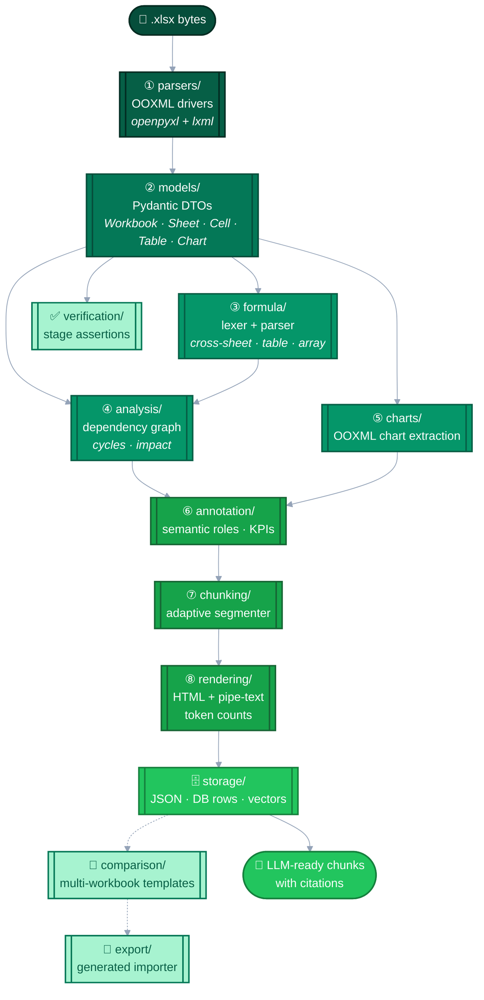

# Architecture

`excel-parser` runs an 8-stage pipeline: **parse → analyse → annotate → segment → render → serialise → verify → compare/export**. The whole graph is deterministic and side-effect-free — you can run the same workbook through it 1,000 times and get the same chunk IDs and hashes.

> The importable module is `excel_parser`; `excel_parser` is a re-export matching the PyPI package name. The package is fully type-annotated (`py.typed` is shipped).

## The 8 stages

| Stage | Module | What it does |
|---|---|---|
| ① Parse | [`parsers/`](../../src/parsers/) | OOXML driver wrapper around `openpyxl` + `lxml`. Emits raw `WorkbookDTO` with cells, merges, hidden rows/cols, conditional formats. |
| ② Models | [`models/`](../../src/models/) | Strict pydantic DTOs for every workbook construct. The contract every downstream stage operates on. |
| ③ Formula | [`formula/`](../../src/formula/) | Lexer + parser for Excel formulas, handling cross-sheet refs, structured-table refs, and array formulas. |
| ④ Analysis | [`analysis/`](../../src/analysis/) | Directed dependency graph between cells, cycle detection, impact analysis. |
| ⑤ Charts | [`charts/`](../../src/charts/) | OOXML chart extraction across 10 chart types (bar/line/pie/scatter/area/radar/bubble/...). |
| ⑥ Annotation | [`annotation/`](../../src/annotation/) | Cell-level semantic roles + KPI detection. Marks header/data/label/output cells. |
| ⑦ Chunking | [`chunking/`](../../src/chunking/) | Adaptive segmenter — connected-components + gap detection + title merging — produces RAG-ready blocks. |
| ⑧ Rendering | [`rendering/`](../../src/rendering/) | HTML and pipe-text rendering per block, token-count estimation, retrieval-friendly raw numeric output. |
| 🗄️ Storage | [`storage/`](../../src/storage/) | Serialiser for JSON / DB rows / vectors. |
| ✅ Verification | [`verification/`](../../src/verification/) | Stage-level invariant assertions — catch parser regressions deterministically. |
| 🔀 Comparison | [`comparison/`](../../src/comparison/) | Compare templates across multiple workbooks to derive a `GeneralizedTemplate`. |
| 🧬 Export | [`export/`](../../src/export/) | Code-generate a Python importer from a generalised template. |

## Where to look next

- **API surface** → [API Reference](API-Reference.md)
- **Stage-by-stage internals** → [Pipeline Internals](Pipeline-Internals.md)
- **DTO field reference** → [Data Models](Data-Models.md)
- **HTTP wrapper** → [Web API](Web-API.md)
